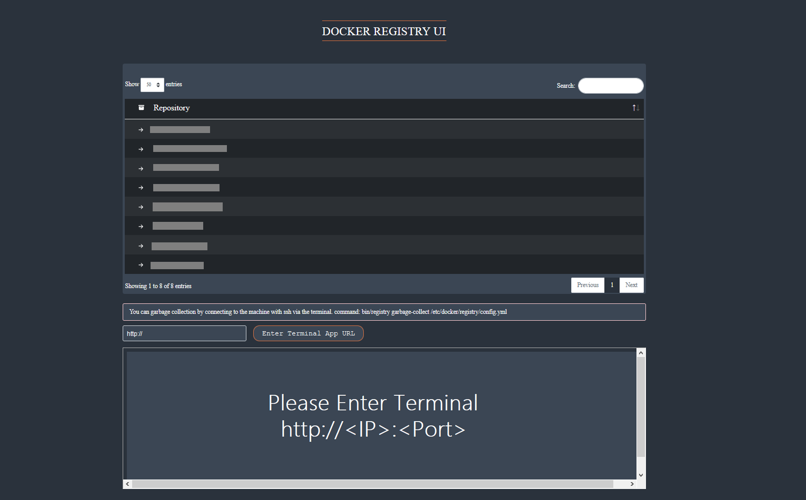

# Docker Registry UI


[](https://srdrcn.semaphoreci.com/projects/registryui)
[](https://srdrcn.semaphoreci.com/projects/registryui)

 [](https://github.com/srdrcn/registryui/blob/master/LICENSE)
 [](https://www.codacy.com/manual/srdrcn/registryui/dashboard?utm_source=github.com&amp;utm_medium=referral&amp;utm_content=srdrcn/registryui&amp;utm_campaign=Badge_Grade)


## Usage

It does not need to be connected with the docker sock. You can easly log in a registry with Your **User** **Password** and **REGISTRY_URL:PORT**. To connect another registry, all you need is logging out of the registry you are connected to and log in again with the new one. It only works with **basic auth** and docker registry **v2**.

As an example, you can run it as follows.


# New Features!

  - **Now there is an internal terminal on the home page.**
    **Two applications are running in image.**<br/>
    The first is registry ui,<br/>
    The second is terminal-app (ttyd) https://tsl0922.github.io/ttyd/

**For this reason, it is necessary to write http://IMAGEMACHINEIP:PORT  on the textbox on the main page, where you run the image.**
 ### Best Practice Usage
  ```sh
 docker run  -d -p  5003:5001 -p 5005:7681 chosenwar/registryui:latest
```



